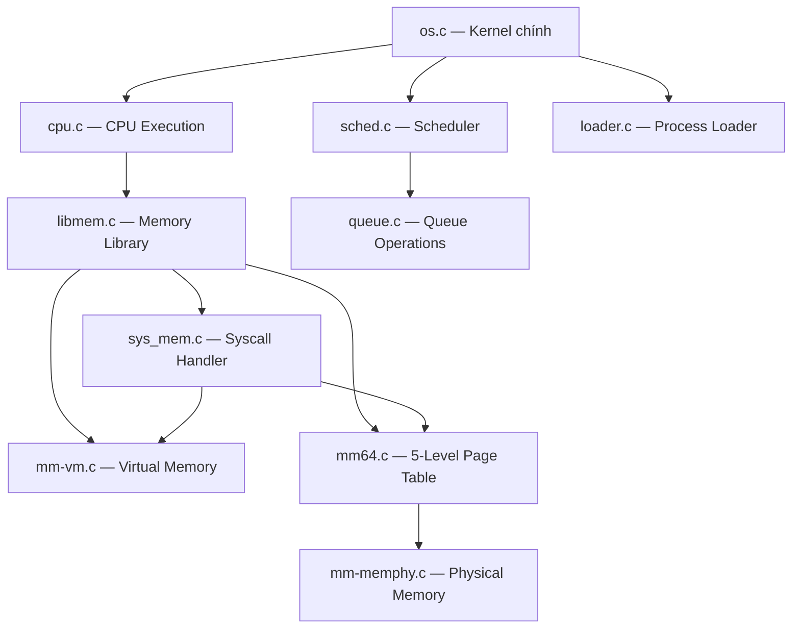
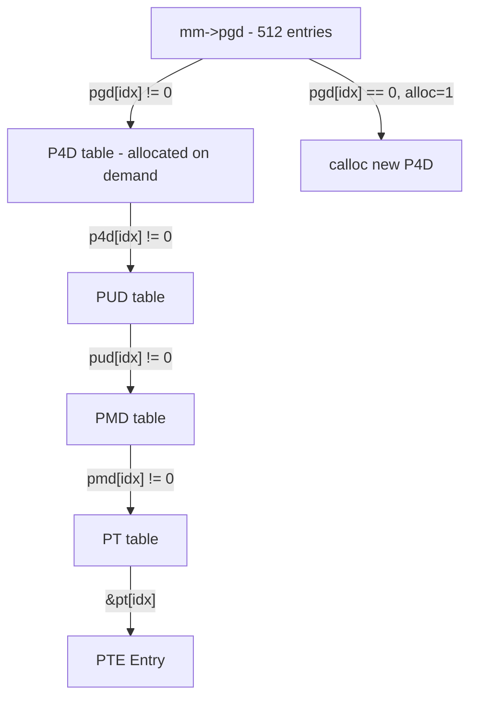
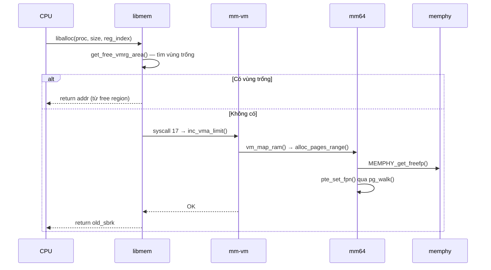

# Tài Liệu Học Tập - OS Simulator (Caitoa Release)

## 1. Tổng Quan

Đây là **bộ mô phỏng hệ điều hành** với các hệ thống con:

| Hệ thống con | File chính | Mô tả |
|:---|:---|:---|
| **Scheduling** | `sched.c`, `queue.c` | Lập lịch đa hàng đợi (MLQ) |
| **Memory Management** | `mm64.c`, `mm-vm.c`, `libmem.c` | Phân trang 5 cấp, cấp phát động (64-bit) |
| **Physical Memory** | `mm-memphy.c` | Quản lý frame RAM và swap devices |
| **Syscall Interface** | `sys_mem.c`, `syscall.c` | Giao tiếp user space ↔ kernel space |
| **Kernel / Loader** | `os.c`, `loader.c` | Khởi tạo hệ thống, nạp process |
| **CPU Execution** | `cpu.c` | Thực thi instruction trên mỗi CPU thread |



---

## 2. Cấu Trúc Dữ Liệu Cốt Lõi

### 2.1 pcb_t — Process Control Block

```c
struct pcb_t {
    uint32_t pid;                     // Process ID
    uint32_t priority;                // Priority mặc định (cố định)
    uint32_t prio;                    // Priority on-fly (MLQ, có thể thay đổi)
    char path[100];                   // Đường dẫn file process
    struct code_seg_t *code;          // Code segment (danh sách instructions)
    addr_t regs[10];                  // Registers (lưu địa chỉ vùng nhớ đã alloc)
    uint32_t pc;                      // Program counter
    struct krnl_t *krnl;              // Con trỏ đến bản copy kernel
    struct page_table_t *page_table;  // Page table (legacy, 32-bit)
    uint32_t bp;                      // Break pointer
};
```

Mỗi process sở hữu một bản **copy** riêng của `krnl_t` (xem mục 2.3).

### 2.2 mm_struct — Quản Lý Bộ Nhớ Ảo (Per-Process)

```c
struct mm_struct {
    // Bảng trang 5 cấp
    addr_t *pgd;    // Page Global Directory (root, luôn allocated)
    addr_t *p4d;    // Page 4-level Directory (allocated on demand)
    addr_t *pud;    // Page Upper Directory
    addr_t *pmd;    // Page Middle Directory
    addr_t *pt;     // Page Table (cấp cuối, chứa PTE)
    
    // Quản lý vùng nhớ ảo
    struct vm_area_struct *mmap;              // Linked list các VMA
    struct vm_rg_struct symrgtbl[30];         // Bảng ký hiệu (symbol table)
    struct pgn_t *fifo_pgn;                   // FIFO queue cho page replacement
    struct kcache_pool_struct *kcpooltbl;     // Kernel cache pool
};
```

Đây là thành phần **riêng biệt cho từng process**, mỗi process có page table và VMA riêng. Nằm bên trong `krnl_t`, truy cập qua `caller->krnl->mm`.

### 2.3 krnl_t — Kernel State

```c
struct krnl_t {
    // Scheduler (shared — tất cả bản copy trỏ đến cùng queue)
    struct queue_t *ready_queue;
    struct queue_t *running_list;
    struct queue_t *mlq_ready_queue;

    // Memory Management
    struct mm_struct *mm;               // ← PER-PROCESS (malloc riêng)
    struct memphy_struct *mram;         // Physical RAM (shared via pointer)
    struct memphy_struct **mswp;        // Swap devices (shared via pointer)
    struct memphy_struct *active_mswp;  // Active swap device
    uint32_t active_mswp_id;

    // Kernel page tables (shared via pointer)
    addr_t *krnl_pgd, *krnl_p4d, *krnl_pud, *krnl_pmd, *krnl_pt;
};
```

**Cơ chế isolation**: Mỗi process nhận bản **shallow copy** của `krnl_t` global qua `*krnl = os`. Các field con trỏ (mram, mswp, queues, krnl_pgd) tự động **shared** vì chỉ copy giá trị pointer. Riêng `krnl->mm` được `malloc` mới → mỗi process có page table riêng.

```
┌──────────────────────────────────────────────┐
│         Global  static krnl_t os             │
│  mram ──────► [Physical RAM]                 │
│  mswp ──────► [Swap Devices]                 │
│  krnl_pgd ──► [Kernel Page Tables]           │
│  ready_queue ► [MLQ Queues]                  │
│  mm = NULL   (không dùng trực tiếp)          │
└──────────────────────────────────────────────┘
        │ *krnl = os (shallow copy)
        ▼
┌─── Process 1 krnl_t ────┐  ┌─── Process 2 krnl_t ────┐
│ mram ──► [same RAM]      │  │ mram ──► [same RAM]      │
│ mswp ──► [same Swap]     │  │ mswp ──► [same Swap]     │
│ mm ─────► [mm_struct #1] │  │ mm ─────► [mm_struct #2] │
│           (pgd riêng)    │  │           (pgd riêng)    │
└──────────────────────────┘  └──────────────────────────┘
```

### 2.4 vm_area_struct — Vùng Nhớ Ảo (VMA)

```c
struct vm_area_struct {
    unsigned long vm_id;               // VMA ID (0 = user space)
    addr_t vm_start, vm_end;           // Phạm vi địa chỉ ảo [start, end)
    addr_t sbrk;                       // Break pointer (điểm cấp phát tiếp theo)
    struct mm_struct *vm_mm;           // Trỏ ngược về mm sở hữu
    struct vm_rg_struct *vm_freerg_list; // Danh sách vùng trống
    struct vm_area_struct *vm_next;    // VMA tiếp theo
};
```

### 2.5 vm_rg_struct — Region trong VMA

```c
struct vm_rg_struct {
    int vmaid;                     // VMA chứa region này
    addr_t rg_start, rg_end;      // Phạm vi [start, end)
    struct vm_rg_struct *rg_next;  // Region tiếp theo
};
```

> **Ghi chú thiết kế**: Trong tài liệu của thầy, struct này có thêm `unsigned long mode_bit` để phân biệt usermode (mode_bit=1) và kernelmode (mode_bit=0). Code hiện tại chưa implement field này, nhưng ý đồ là mm_struct có thể quản lý cả vùng nhớ user và kernel, phân biệt qua mode_bit.

### 2.6 PTE — Page Table Entry (32-bit format)

Mỗi virtual page được quản lý bởi một Page Table Entry (PTE) 32-bit, dùng để ánh xạ địa chỉ ảo sang frame vật lý trong RAM hoặc vị trí trong swap.

```
┌─────────┬─────────┬─────────┬───────────┬─────────────────────────────┐
│ PRESENT │ SWAPPED │ DIRTY   │ USRNUM    │ FPN (bits 12-0) hoặc SWAP   │
│ bit 31  │ bit 30  │ bit 28  │ bits27-15 │ info nếu đang ở swap        │
└─────────┴─────────┴─────────┴───────────┴─────────────────────────────┘
```

Chi tiết từng bit:

| Bit(s) | Ý nghĩa |
|:---|:---|
| 0–12 | **Frame Page Number (FPN)** nếu page đang ở RAM |
| 13–14 | Reserved (0) |
| 15–27 | User-defined numbering |
| 0–4 | Swap type nếu page đang ở SWAP |
| 5–25 | Swap offset nếu page đang ở SWAP |
| 28 | Dirty bit |
| 29 | Reserved |
| 30 | Swapped bit |
| 31 | Present bit |

| Trạng thái | PRESENT | SWAPPED | Ý nghĩa |
|:---|:---|:---|:---|
| Page ở RAM | 1 | 0 | FPN chứa frame number vật lý |
| Page đã swap | 0 | 1 | Chứa swap type + swap offset |
| Chưa map | 0 | 0 | Chưa có ánh xạ nào |

> **Lưu ý**: Khi page bị đẩy ra swap (`pte_set_swap`), bit PRESENT bị **clear** (= 0), không phải set. Đây là điểm dễ nhầm — `PAGING_PAGE_PRESENT(pte) == 0` mới là điều kiện kích hoạt swap-in.

### 2.7 memphy_struct & framephy_struct — Bộ Nhớ Vật Lý

Mỗi thiết bị bộ nhớ vật lý (RAM hoặc Swap) được đại diện bằng `memphy_struct`. Các frame bên trong được quản lý qua linked list `framephy_struct`.

```c
struct framephy_struct {
    addr_t fpn;                        // Frame page number
    struct framephy_struct *fp_next;   // Frame kế tiếp trong list

    /* Tracking frame được cấp phát */
    struct mm_struct *owner;           // Process đang sở hữu frame này
};

struct memphy_struct {
    BYTE *storage;                     // Vùng lưu trữ dữ liệu thực tế
    int maxsz;                         // Kích thước tối đa (bytes)

    int rdmflg;                        // 1 = random access (RAM), 0 = sequential (Swap)
    int cursor;                        // Con trỏ hiện tại (dùng cho sequential device)

    struct framephy_struct *free_fp_list;  // Danh sách frame trống
    struct framephy_struct *used_fp_list;  // Danh sách frame đang dùng
};
```

**Ví dụ — RAM 2^14 bytes (4 frame)**:

```
       RAM
+-------------------+
| Frame 0           |  0 → 4095
+-------------------+
| Frame 1           |  4096 → 8191
+-------------------+
| Frame 2           |  8192 → 12287
+-------------------+
| Frame 3           |  12288 → 16383
+-------------------+

free_fp_list: Frame 0 → Frame 1 → Frame 2 → Frame 3 → NULL
used_fp_list: NULL
rdmflg: 1 (RAM — random access)
```

`rdmflg = 1` phân biệt RAM (truy cập ngẫu nhiên) với Swap (truy cập tuần tự theo cursor).

---

## 3. Các Module Chi Tiết

### 3.0 Bộ Nhớ User Space và Kernel Space

#### Khái niệm

- **User space**: Vùng bộ nhớ dành cho các chương trình người dùng (process). Process chỉ được truy cập vùng nhớ của chính nó — không thể truy cập trực tiếp phần cứng hay bộ nhớ kernel.
- **Kernel space**: Vùng bộ nhớ dành cho hệ điều hành. Chứa kernel code, page table, driver, kernel heap/cache và có quyền truy cập toàn bộ RAM, thiết bị phần cứng.

Khi user program cần thao tác đặc quyền (I/O, cấp phát trang, swap, đọc/ghi RAM…), nó gọi **system call** để chuyển từ user space sang kernel space.

#### Sơ đồ phân chia Virtual Memory Space (64-bit)

```
                    VIRTUAL MEMORY SPACE (64-bit)

0xFFFFFFFFFFFFFFFF  ┌──────────────────────────────────────┐
                    │             Kernel Space             │
                    │                                      │
                    │  KMALLOC                             │
                    │  KMEM_CACHE_CREATE                   │
                    │  KMEM_CACHE_ALLOC                    │
                    │  COPY_FROM_USER                      │
                    │  COPY_TO_USER                        │
                    │                                      │
                    │  kernel code / heap / cache          │
                    │  krnl_pgd / driver / kmem            │
                    │                                      │
0xFFFF800000000000  ├──────────── KERNEL_BASE ─────────────┤
                    │                                      │
                    │              User Space              │
                    │                                      │
                    │  ALLOC / FREE / READ / WRITE         │
                    │  CALC / SYSCALL                      │
                    │                                      │
                    │  stack / heap / mmap / code          │
                    │  mỗi process có pgd riêng            │
                    │                                      │
0x0000000000000000  └──────────────────────────────────────┘
```

`KERNEL_BASE = 0xffff800000000000ULL`

#### alloc vs kmalloc

| | `alloc` / `malloc` (user) | `kmalloc` (kernel) |
|:---|:---|:---|
| Vùng nhớ | User space | Kernel space |
| Page table | `mm->pgd` riêng của process | `krnl->krnl_pgd` shared |
| Quản lý | `vm_freerg_list`, `symrgtbl` | `symrgtbl` với `mode_bit=0`, `kcpooltbl` |
| Ai dùng | Chương trình người dùng | Kernel (cache, driver, system data) |

**Ví dụ**:

```bash
# USER MEMORY
alloc 100 1          # Cấp phát 100 bytes, lưu vào symrgtbl[1]
write 65 1 0         # Ghi giá trị 65 ('A') vào offset 0 của vùng nhớ số 1

# KERNEL MEMORY
kmalloc 200 2        # Kernel cấp phát 200 bytes trong kernel space, lưu vào symrgtbl[2]
copy_from_user 1 2 0 10  # Copy 10 bytes từ user region 1 sang kernel region 2 offset 0
```

### 3.1 `queue.c` — Hàng Đợi Tiến Trình

Cung cấp cấu trúc FIFO cho scheduler. Hình dung queue như một hàng người xếp hàng: ai đến trước thì được phục vụ trước.

**`void enqueue(struct queue_t *q, struct pcb_t *proc)`**
- **Mục đích**: Thêm một process vào **cuối** hàng đợi
- **Logic**: Kiểm tra queue chưa đầy (`size < MAX_QUEUE_SIZE`), rồi đặt process vào `q->proc[q->size]`, tăng `size` lên 1
- **Tại sao thêm cuối**: Đây là FIFO — ai vào trước thì ra trước

**`struct pcb_t *dequeue(struct queue_t *q)`**
- **Mục đích**: Lấy process **đầu tiên** ra khỏi hàng đợi
- **Logic**: Lấy `q->proc[0]`, rồi dịch (shift) tất cả phần tử còn lại lên 1 vị trí. Giảm `size` đi 1
- **Tại sao lấy đầu**: FIFO — phần tử đầu là phần tử vào trước nhất

**`struct pcb_t *purgequeue(struct queue_t *q, struct pcb_t *proc)`**
- **Mục đích**: Xóa một process **cụ thể** khỏi hàng đợi (dùng khi process kết thúc hoặc cần xóa khỏi running_list)
- **Logic**: Duyệt tìm process theo con trỏ, khi tìm thấy thì shift các phần tử phía sau lên, giảm `size`

### 3.2 `sched.c` — Bộ Lập Lịch MLQ

```c
static struct queue_t mlq_ready_queue[MAX_PRIO]; // 140 hàng đợi theo priority
```

**`struct pcb_t *get_mlq_proc(void)`**
- **Mục đích**: Lấy process có priority **cao nhất** (số nhỏ nhất) để giao cho CPU chạy
- **Logic**:
  1. `pthread_mutex_lock` — khóa mutex vì nhiều CPU thread cùng gọi hàm này. Nếu không lock, 2 CPU có thể lấy cùng 1 process
  2. Duyệt từ priority 0 → MAX_PRIO, tìm hàng đợi không rỗng **đầu tiên** (priority 0 = cao nhất)
  3. `dequeue()` process ra khỏi hàng đợi đó
  4. `pthread_mutex_unlock` — mở khóa
  5. Thêm process vào `running_list` — để khi process gọi syscall, kernel tìm lại được nó

**`void put_mlq_proc(struct pcb_t *proc)`**
- **Mục đích**: Đưa process **trở lại** hàng đợi MLQ khi hết time slot
- **Logic**: Enqueue vào `mlq_ready_queue[proc->prio]` — process quay lại đúng hàng đợi theo priority của nó

**`void add_mlq_proc(struct pcb_t *proc)`**
- **Mục đích**: Thêm process **mới** vào MLQ (gọi khi loader vừa load process xong)

### 3.3 `mm64.c` — Bảng Trang 5 Cấp (Core)

#### Kiến trúc địa chỉ ảo 57-bit

```
┌──────────┬──────────┬──────────┬──────────┬──────────┬────────────┐
│ PGD(9bit)│ P4D(9bit)│ PUD(9bit)│ PMD(9bit)│ PT(9bit) │ Offset(12) │
│ bit56-48 │ bit47-39 │ bit38-30 │ bit29-21 │ bit20-12 │ bit11-0    │
└──────────┴──────────┴──────────┴──────────┴──────────┴────────────┘
```

Với `PAGING64_MAX_PGN = 512` (RAM 2MB, page 4KB), các index PGD/P4D/PUD/PMD luôn = 0, chỉ PT index thay đổi (0-511).

#### `pg_walk(mm, pgn, alloc)` — Duyệt bảng trang

```c
static addr_t* pg_walk(struct mm_struct *mm, addr_t pgn, int alloc)
```

Cho page number → trả về **con trỏ đến PTE entry**.

| Tham số `alloc` | Hành vi khi sub-table chưa tồn tại |
|:---|:---|
| `alloc = 1` | `calloc()` table mới → dùng khi **set** PTE |
| `alloc = 0` | Return NULL → dùng khi **get** PTE |

**Luồng xử lý**: Tách `pgn` thành 5 index → Đi từ PGD → P4D → PUD → PMD → PT. Ở mỗi tầng, nếu entry == 0 và `alloc=1` → cấp phát sub-table mới.



#### Các hàm PTE (Page Table Entry)

**`int pte_set_fpn(struct pcb_t *caller, addr_t pgn, addr_t fpn)`**
- **Mục đích**: Đánh dấu page `pgn` đang nằm trong RAM, tại frame number `fpn`
- **Logic**: Gọi `pg_walk(caller->krnl->mm, pgn, 1)` để lấy con trỏ PTE, rồi set bit PRESENT, clear bit SWAPPED, ghi FPN vào PTE
- **Khi nào gọi**: Khi vừa cấp phát frame mới cho page, hoặc khi swap page từ disk về RAM

**`int pte_set_swap(struct pcb_t *caller, addr_t pgn, int swptyp, addr_t swpoff)`**
- **Mục đích**: Đánh dấu page `pgn` đã bị đẩy ra swap disk, vị trí lưu = `swpoff`
- **Logic**: Gọi `pg_walk(mm, pgn, 1)`, **clear** bit PRESENT (page không còn ở RAM), set bit SWAPPED, ghi swap type và swap offset
- **Khi nào gọi**: Khi victim page bị đuổi khỏi RAM để nhường chỗ cho page khác

**`uint32_t pte_get_entry(struct pcb_t *caller, addr_t pgn)`**
- **Mục đích**: Đọc giá trị PTE của page `pgn`
- **Logic**: Gọi `pg_walk(mm, pgn, 0)` — truyền `alloc=0` nên nếu page chưa tồn tại trong bảng trang thì return 0 (không cấp phát mới)
- **Khi nào gọi**: Khi cần kiểm tra page đang ở RAM hay swap, hoặc lấy FPN

**`int pte_set_entry(struct pcb_t *caller, addr_t pgn, uint32_t pte_val)`**
- **Mục đích**: Ghi trực tiếp một giá trị PTE bất kỳ (dùng cho trường hợp đặc biệt)

#### `init_mm(mm, caller)` — Khởi tạo bộ nhớ cho process mới

- **Mục đích**: Tạo không gian bộ nhớ ảo trống cho một process mới được load
- **Logic**:
  1. `calloc()` PGD root table (512 entries, tất cả = 0) — đây là bảng trang gốc
  2. `p4d = pud = pmd = pt = NULL` — các sub-table sẽ được tạo khi cần (on demand)
  3. Tạo VMA0 — vùng nhớ ảo mặc định cho user space, bắt đầu từ address 0, sbrk = 0
  4. Gán `mm->mmap = vma0` — gắn VMA0 vào mm

#### `alloc_pages_range(caller, req_pgnum, frm_lst)` — Xin frame vật lý

- **Mục đích**: Yêu cầu `req_pgnum` frame vật lý từ RAM
- **Logic**: Gọi `MEMPHY_get_freefp()` lặp lại nhiều lần, mỗi lần lấy 1 frame trống. Các frame được nối thành linked list qua `frm_lst`
- **Trả -3000**: Nếu RAM hết frame trống → out of memory
- **Ví dụ**: Process cần 3 page → hàm này xin 3 frame từ RAM, trả về list [frame5 → frame8 → frame12]

#### `vmap_page_range(caller, addr, pgnum, frames, ret_rg)` — Map page vào page table

- **Mục đích**: Gắn các frame vật lý (từ `alloc_pages_range`) vào bảng trang của process
- **Logic**: Với mỗi page trong dãy:
  1. Lấy frame tiếp theo từ `frames` list
  2. `pte_set_fpn(caller, pgn, fpn)` — ghi vào PTE: "page này nằm ở frame này"
  3. `enlist_pgn_node(&mm->fifo_pgn, pgn)` — thêm vào danh sách FIFO để theo dõi thứ tự sử dụng (dùng cho page replacement sau này)

#### `vm_map_ram(caller, astart, aend, mapstart, incpgnum, ret_rg)` — Tổng hợp

- **Mục đích**: Kết hợp 2 bước trên: xin frame + map vào page table
- **Logic**: Gọi `alloc_pages_range()` xin frame → `vmap_page_range()` map vào bảng trang
- **Khi nào gọi**: Khi `inc_vma_limit()` cần mở rộng vùng nhớ cho process

#### `print_pgtbl(caller, start, end)` — In bảng trang (debug)

- **Mục đích**: In địa chỉ bảng trang ở mỗi cấp để kiểm tra memory isolation
- **Format**: `PID : <pid>` + `PDG=<addr> P4g=<addr> PUD=<addr> PMD=<addr>`
- **Lưu ý**: Do multi-CPU chạy song song, log từ nhiều CPU có thể xen kẽ. PID giúp phân biệt output của process nào

#### `vm_map_kernel(caller, incpgnum, ret_rg)` — Map frame vào kernel space

```c
addr_t vm_map_kernel(struct pcb_t *caller, int incpgnum, struct vm_rg_struct *ret_rg)
```

- **Mục đích**: Cấp phát frame vật lý và map chúng vào **kernel virtual address space** (không phải user pgd)
- **Logic**:
  1. Gọi `alloc_pages_range()` để lấy frame từ RAM
  2. Tính `rg_start = KERNEL_BASE + fpn * PAGING64_PAGESZ` (địa chỉ kernel virtual của frame)
  3. Duyệt `krnl->krnl_pgd` (không phải `mm->pgd`) theo từng tầng PGD→P4D→PUD→PMD→PT
  4. Set PTE trong kernel page table: PRESENT=1, SWAPPED=0, FPN = fpn
- **Khi nào gọi**: Khi `__kmalloc` cần cấp phát vùng nhớ trong kernel space
- **Lưu ý**: Giả định hiện tại `incpgnum = 1` (chỉ hỗ trợ 1 frame). `alloc_pages_range` không đảm bảo frame liên tục nên cần xử lý riêng nếu cần nhiều hơn.

### 3.4 `mm-vm.c` — Virtual Memory Management

Quản lý vùng nhớ ảo (VMA). Hình dung VMA như một "khoảng đất" trong không gian địa chỉ ảo — process xin thêm đất khi cần alloc memory.

**`int inc_vma_limit(struct pcb_t *caller, int vmaid, addr_t inc_sz)`**
- **Mục đích**: Mở rộng vùng nhớ ảo khi process cần thêm bộ nhớ (giống `sbrk()` trong Linux)
- **Khi nào gọi**: Khi `__alloc()` không tìm được vùng trống trong free region list
- **Logic**:
  1. Tính `inc_amt` = align `inc_sz` lên bội số page size (4KB)
  2. Tính `incnumpage` = số page cần thêm
  3. `get_vm_area_node_at_brk()` → tạo region mới tại break pointer hiện tại
  4. Lưu `old_end = cur_vma->sbrk` (vị trí bắt đầu vùng mới)
  5. Cập nhật `cur_vma->vm_end += inc_sz` và `cur_vma->sbrk += inc_sz` (mở rộng VMA)
  6. `vm_map_ram()` → cấp phát frame vật lý thật + ghi vào page table

**`struct vm_rg_struct *get_vm_area_node_at_brk(caller, vmaid, size, alignedsz)`**
- **Mục đích**: Tạo một region node mới tại vị trí break pointer hiện tại
- **Logic**: `rg_start = cur_vma->sbrk` (vị trí hiện tại), `rg_end = sbrk + size`
- **Ví dụ**: Nếu sbrk = 8192, size = 4096 → region [8192, 12288)

**`int validate_overlap_vm_area(caller, vmaid, vmastart, vmaend)`**
- **Mục đích**: Kiểm tra vùng nhớ mới có **chồng lấn** với VMA đã có không
- **Logic**: Duyệt tất cả VMA, dùng macro `OVERLAP()` kiểm tra. Return -1 nếu overlap

### 3.5 `libmem.c` — Memory Library (Giao Diện CPU ↔ Memory)

Cung cấp các hàm CPU gọi khi thực thi instruction ALLOC/FREE/READ/WRITE.

#### Luồng ALLOC



**`int pg_getpage(struct mm_struct *mm, int pgn, int *fpn, struct pcb_t *caller)`**
- **Mục đích**: Đảm bảo page `pgn` **có mặt trong RAM**. Nếu page đang nằm trên swap disk → đưa nó về RAM
- **Trường hợp 1** — Page đã ở RAM (PRESENT=1, SWAPPED=0): Đơn giản lấy FPN từ PTE, xong
- **Trường hợp 2** — Page ở swap (cần swap-in): Đây là trường hợp phức tạp:
  1. `find_victim_page(mm)` → chọn page cũ nhất (theo FIFO) để đuổi khỏi RAM
  2. `MEMPHY_get_freefp(active_mswp)` → tìm frame trống trên swap disk
  3. Copy nội dung victim frame từ RAM → swap disk (victim bị đuổi)
  4. Copy nội dung target page từ swap disk → victim's frame trong RAM (target được đưa về)
  5. `pte_set_swap(victim_pgn)` → cập nhật PTE victim: "bây giờ tôi ở swap"
  6. `pte_set_fpn(target_pgn)` → cập nhật PTE target: "bây giờ tôi ở RAM"
  7. Thêm target vào FIFO list (để sau này bị đuổi nếu cần)

**`int pg_getval(struct mm_struct *mm, int addr, BYTE *data, struct pcb_t *caller)`**
- **Mục đích**: Đọc 1 byte từ địa chỉ ảo `addr`
- **Logic**:
  1. Tách `addr` → page number (PGN) + offset trong page
  2. `pg_getpage()` → đảm bảo page ở RAM, lấy được FPN
  3. `phyaddr = FPN * PAGE_SIZE + offset` → tính địa chỉ vật lý thật
  4. `MEMPHY_read(mram, phyaddr, data)` → đọc byte từ RAM vật lý

**`int pg_setval(struct mm_struct *mm, int addr, BYTE value, struct pcb_t *caller)`**
- **Mục đích**: Ghi 1 byte vào địa chỉ ảo `addr` — logic tương tự pg_getval nhưng dùng `MEMPHY_write`

**`int find_victim_page(struct mm_struct *mm, addr_t *retpgn)`**
- **Mục đích**: Chọn page để đuổi khỏi RAM khi RAM đầy (thuật toán **FIFO**)
- **Logic**: Duyệt linked list `mm->fifo_pgn` đến **phần tử cuối cùng** (oldest). Xóa nó và trả page number
- **Tại sao lấy cuối**: `enlist_pgn_node()` luôn thêm page mới vào **đầu** list → phần tử cuối = page **cũ nhất** → đúng FIFO (First In, First Out)

**`int get_free_vmrg_area(struct pcb_t *caller, int vmaid, int size, struct vm_rg_struct *newrg)`**
- **Mục đích**: Tìm vùng nhớ trống đủ lớn cho yêu cầu alloc
- **Logic**: Duyệt `vm_freerg_list`, tìm region có kích thước `>= size`
  - Nếu region vừa đúng → dùng hết
  - Nếu region lớn hơn → cắt phần cần, giữ phần dư lại trong free list
- **Return -1**: Nếu không tìm được vùng trống → caller phải gọi `inc_vma_limit()` để mở rộng VMA

**`int enlist_vm_freerg_list(struct mm_struct *mm, struct vm_rg_struct *rg_elmt)`**
- **Mục đích**: Chèn một vùng nhớ vừa được `free` trở lại danh sách `vm_freerg_list`, giữ thứ tự theo địa chỉ và **gộp (coalesce) các vùng liền kề** nếu có
- **Logic**:
  1. Validate: `rg_elmt != NULL` và `rg_start < rg_end`
  2. Duyệt list tìm vị trí chèn theo thứ tự tăng dần của `rg_start`
  3. Chèn node mới vào giữa `prev` và `cur`
  4. Kiểm tra gộp với vùng kế tiếp: nếu `rg_elmt->rg_end == cur->rg_start` → merge
  5. Kiểm tra gộp với vùng phía trước: nếu `prev->rg_end == rg_elmt->rg_start` → merge
- **Tại sao gộp**: Tránh phân mảnh bộ nhớ (fragmentation) — nhiều vùng nhỏ liền kề được hợp thành 1 vùng lớn để tái sử dụng

**`addr_t __kmalloc(struct pcb_t *caller, int vmaid, int rgid, addr_t size, addr_t *alloc_addr)`**
- **Mục đích**: Cấp phát bộ nhớ trong **kernel space** (tương tự `kmalloc` trong Linux kernel)
- **Logic**:
  1. Align `size` lên bội số page size: `req_size = PAGING64_PAGE_ALIGNSZ(size)`
  2. Tính số page cần: `incpgnum = req_size / PAGING64_PAGESZ`
  3. Gọi `vm_map_kernel()` → map frame vào kernel virtual space
  4. Gán `alloc_addr = newrg.rg_start`, cập nhật `symrgtbl[rgid]` với `mode_bit = 0` (kernel mode)
- **Khi nào gọi**: Khi process cần cấp phát bộ nhớ kernel (driver, cache, system data)

**`int libkmem_cache_pool_create(struct pcb_t *caller, uint32_t size, uint32_t align, uint32_t cache_pool_id)`**
- **Mục đích**: Tạo một **kernel memory cache pool** — vùng nhớ kernel được pre-allocate để phân phối nhanh các object cùng kích thước (kiểu slab allocator đơn giản)
- **Logic**: Tương tự `__kmalloc` nhưng cập nhật `krnl->mm->kcpooltbl[cache_pool_id]` thay vì `symrgtbl`
- **Khi nào dùng**: Khi kernel cần liên tục cấp phát/giải phóng nhiều object cùng kích thước (VD: PCB, page descriptor...)

**`addr_t __kmem_cache_alloc(struct pcb_t *caller, int vmaid, int rgid, int cache_pool_id, addr_t *alloc_addr)`**
- **Mục đích**: Lấy một slot từ cache pool đã tạo sẵn bằng `libkmem_cache_pool_create`
- **Logic**: Tra `krnl->mm->kcpooltbl[cache_pool_id]` → lấy `pool->storage` làm địa chỉ → cập nhật `symrgtbl[rgid]`
- **Ưu điểm**: Nhanh hơn `__kmalloc` vì không cần cấp phát frame mới, chỉ lấy từ pool có sẵn

**`int __read_user_mem / __write_user_mem(caller, vmaid, rgid, offset, data/value)`**
- **Mục đích**: Đọc/ghi 1 byte từ **user memory region** (qua page table của process)
- **Logic**: Tra `symrgtbl[rgid]`, tính địa chỉ ảo = `rg_start + offset`, gọi `pg_getval` / `pg_setval`

**`int __read_kernel_mem / __write_kernel_mem(caller, vmaid, rgid, offset, data/value)`**
- **Mục đích**: Đọc/ghi 1 byte từ **kernel memory region** (qua kernel page table)
- **Logic** (khác với user mem):
  1. Tra `symrgtbl[rgid]` lấy `rg_start`
  2. Tính `kva = rg_start + offset` (kernel virtual address)
  3. Tách `kva` → `pgn` + `off`
  4. Duyệt `krnl->krnl_pgd` (không phải `mm->pgd`) để tìm FPN
  5. Tính `phyaddr = fpn * PAGING64_PAGESZ + off`
  6. `MEMPHY_read/write(mram, phyaddr, data/value)`
- **Điểm khác biệt then chốt**: Dùng `krnl_pgd` thay vì `mm->pgd` — đây là kernel page table, không qua cơ chế swap của user

 — System Call Handler

#### `__sys_memmap(krnl, pid, regs)`

Kernel handler cho syscall 17. Tìm đúng process caller bằng cách duyệt `running_list` match PID.

| Operation | Hàm gọi | Mô tả |
|:---|:---|:---|
| `SYSMEM_MAP_OP` | `vmap_pgd_memset()` | Map page table |
| `SYSMEM_INC_OP` | `inc_vma_limit()` | Tăng giới hạn VMA |
| `SYSMEM_SWP_OP` | `__mm_swap_page()` | Swap RAM ↔ Disk |
| `SYSMEM_IO_READ` | `MEMPHY_read()` | Đọc physical memory |
| `SYSMEM_IO_WRITE` | `MEMPHY_write()` | Ghi physical memory |

### 3.7 `os.c` — Kernel Chính

#### `ld_routine()` — Loader

1. Init kernel page tables (`krnl_pgd/p4d/pud/pmd/pt`)
2. Với mỗi process:
   - `load(path)` → parse file, tạo PCB
   - `malloc(sizeof(struct krnl_t))`, `*krnl = os` → shallow copy kernel
   - `krnl->mm = malloc(...)`, `init_mm(krnl->mm, proc)` → mm riêng
   - `krnl->mram = mram; krnl->mswp = mswp` → gán physical memory
   - `add_proc(proc)` → đưa vào MLQ

#### `cpu_routine()` — CPU Thread

1. `get_proc()` → lấy process từ MLQ (priority cao nhất)
2. `run(proc)` → thực thi 1 instruction
3. Hết time slot → `put_proc()` trả lại MLQ
4. Process xong (`pc == code->size`) → `free(proc)`, lấy process mới
5. Không còn process + `done == 1` → CPU dừng

### 3.8 `mm-memphy.c` — Physical Memory

- `init_memphy(mp, maxsz, rdmflag)` — Khởi tạo vùng nhớ vật lý
- `MEMPHY_read/write(mp, addr, data)` — Đọc/ghi byte
- `MEMPHY_get_freefp(mp, fpn)` — Lấy frame trống
- `MEMPHY_put_freefp(mp, fpn)` — Trả frame về free list
- `MEMPHY_dump(mp)` — In nội dung memory (debug)

---

## 4. Luồng Thực Thi Hoàn Chỉnh

### Khởi động

```
main() → read_config()
       → init_memphy(&mram) + mswp[]
       → init_scheduler()
       → pthread_create(ld_routine)    // Loader thread
       → pthread_create(cpu_routine)   // N CPU threads
```

### Vòng đời Process

```
load(path) → malloc(krnl_t) + *krnl = os → init_mm(krnl->mm)
           → add_proc() → MLQ ready queue
           → get_proc() → CPU dispatch
           → run() × time_slot lần
           → put_proc() → MLQ (round-robin)
           → ... lặp lại ...
           → pc == code->size → free(proc)
```

### Memory Operation Flow

```
# User Space Operations
ALLOC  → liballoc → __alloc → get_free_vmrg_area
                            → [miss] → syscall 17 → inc_vma_limit
                                                   → vm_map_ram
                                                   → alloc_pages_range + vmap_page_range

READ   → libread  → __read_user_mem  → pg_getval → pg_getpage → [swap-in nếu cần]
                                                  → MEMPHY_read

WRITE  → libwrite → __write_user_mem → pg_setval → pg_getpage → [swap-in nếu cần]
                                                  → MEMPHY_write

FREE   → libfree  → __free → enlist_vm_freerg_list (gộp vùng liền kề)

# Kernel Space Operations
KMALLOC         → __kmalloc → vm_map_kernel → alloc_pages_range
                                            → map vào krnl_pgd

KMEM_CACHE_CREATE → libkmem_cache_pool_create → vm_map_kernel → kcpooltbl

KMEM_CACHE_ALLOC  → __kmem_cache_alloc → kcpooltbl[pool_id].storage → symrgtbl

READ kernel   → __read_kernel_mem  → krnl_pgd (không qua swap) → MEMPHY_read
WRITE kernel  → __write_kernel_mem → krnl_pgd (không qua swap) → MEMPHY_write
```


---

## 5. So Sánh Với Code Gốc

### 5.1 Bug trong code gốc `os.c`

```c
// GỐC (BUG) — line 140
struct krnl_t * krnl = proc->krnl = &os;  // TẤT CẢ process trỏ đến cùng 1 &os
krnl->mm = malloc(sizeof(struct mm_struct));  // GHI ĐÈ mm mỗi lần load
```

**Vấn đề**: Khi load process 2, `os.mm` bị overwrite → process 1 mất page table.

```c
// ĐÃ SỬA — mỗi process nhận bản copy riêng
struct krnl_t * krnl = malloc(sizeof(struct krnl_t));
*krnl = os;           // Shallow copy → mram, mswp, queues tự động shared (pointer copy)
proc->krnl = krnl;
krnl->mm = malloc(sizeof(struct mm_struct));  // mm riêng cho process
init_mm(krnl->mm, proc);
krnl->mram = mram;    // Gán physical memory
krnl->mswp = mswp;
krnl->active_mswp = active_mswp;
```

### 5.2 Bug trong code gốc `sys_mem.c`

```c
// GỐC (BUG) — tạo dummy process, không liên kết với process thực
struct pcb_t *caller = malloc(sizeof(struct pcb_t));
caller->krnl = malloc(sizeof(struct krnl_t));
```

```c
// ĐÃ SỬA — duyệt running_list tìm đúng process caller
struct pcb_t *caller = NULL;
struct pcb_t *tmp = NULL;
int i;
for (i = 0; i < krnl->running_list->size; i++) {
    tmp = krnl->running_list->proc[i];
    if (tmp->pid == pid) {
        caller = tmp;
        break;
    }
}
```

### 5.3 Tổng hợp các file cần thay đổi so với gốc

| File | Gốc | Hiện tại |
|:---|:---|:---|
| `os.c` | `proc->krnl = &os` (bug) | `malloc + *krnl = os` (mm riêng mỗi process) |
| `sys_mem.c` | Tạo dummy `malloc(pcb_t)` | Duyệt `running_list` match PID |
| `mm64.c` | Các hàm PTE dùng dummy `malloc` PTE, TODO trống | Implement `pg_walk()`, PTE functions dùng bảng trang thật, `init_mm`, `alloc_pages_range`, `vmap_page_range`, `vm_map_kernel`, `print_pgtbl` |
| `mm-vm.c` | `inc_vma_limit` trống (return 0) | Implement đầy đủ: tính inc_amt, get_vm_area_node_at_brk, update sbrk, vm_map_ram |
| `libmem.c` | `pg_getval/pg_setval` trống, `pg_getpage` swap chưa implement | Implement đọc/ghi user mem qua page table, swap logic đầy đủ, `enlist_vm_freerg_list` có coalesce, kernel mem (`__kmalloc`, `__kmem_cache_alloc`, `__read/write_kernel_mem`, `libkmem_cache_pool_create`) |
| `queue.c` | Trống | Implement `enqueue`, `dequeue`, `purgequeue` |
| `sched.c` | `get_mlq_proc` trống | Implement với mutex + running_list tracking |
| `mm-memphy.c` | `MEMPHY_dump` trống | Implement in memory content |