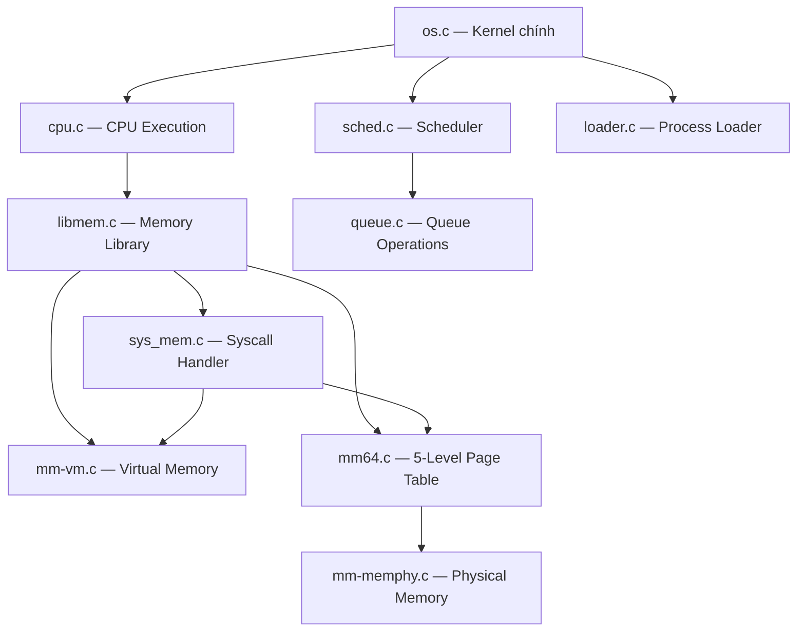

# Tài Liệu Học Tập - OS Simulator (BTL OS Hướng Dẫn Triển Khai)

Tài liệu này giải thích chi tiết cấu trúc hệ thống mô phỏng Hệ Điều Hành (OS Simulator), đi sâu vào các cấu trúc dữ liệu cốt lõi, vai trò của từng file mã nguồn, và cách luồng thực thi diễn ra từ khi nạp một tiến trình cho đến khi kết thúc. Mục tiêu là giúp sinh viên với kiến thức OS nền tảng có thể hiểu, theo dõi và tự triển khai lại được toàn bộ các file chưa hoàn thiện (`TODO`).

---

## 1. Tổng Quan Kiến Trúc

Bộ mô phỏng được cấu trúc thành các module (hệ thống con) tách biệt, mô phỏng cách một OS thực tế hoạt động:

| Hệ thống con | File chính | Mô tả |
|:---|:---|:---|
| **Lập lịch (Scheduling)** | `sched.c`, `queue.c` | Lập lịch tiến trình dựa trên thuật toán đa hàng đợi (MLQ - Multi-Level Queue). Quyết định tiến trình nào được nắm quyền điều khiển CPU. |
| **Quản lý bộ nhớ (Memory Management)** | `mm64.c`, `mm-vm.c`, `libmem.c` | Đây là trung tâm của bộ mô phỏng: Cài đặt hệ thống bộ nhớ ảo, cơ chế phân trang 5 cấp (5-level paging) ở kiến trúc 64-bit, cấp phát động bộ nhớ (on-demand), và xử lý swap. |
| **Bộ nhớ vật lý (Physical Memory)** | `mm-memphy.c` | Mô phỏng RAM vật lý và ổ đĩa Swap. Cung cấp API đọc/ghi và cấp phát/thu hồi khung trang (frame). |
| **Syscall Interface** | `sys_mem.c`, `syscall.c` | Giao diện để ứng dụng (User Space) yêu cầu OS (Kernel Space) cấp phát bộ nhớ, đọc/ghi ảo. |
| **Kernel / Loader** | `os.c`, `loader.c` | Nạp mã máy từ file text, tạo PCB cho tiến trình, khởi tạo Kernel và môi trường thực thi. |
| **CPU Execution** | `cpu.c` | Mô phỏng các CPU chạy đa luồng (`pthread`), đọc và thực thi từng lệnh ảo. |

### Sơ đồ tương tác:


---

## 2. Cấu Trúc Dữ Liệu Cốt Lõi

Để hiểu HĐH, ta phải hiểu cách nó tổ chức dữ liệu.

### 2.1 Khối Điều Khiển Tiến Trình: `pcb_t` (Process Control Block)
Đại diện cho một chương trình đang chạy. HĐH quản lý các tiến trình qua danh sách các PCB.
```c
struct pcb_t {
    uint32_t pid;                     // Process ID duy nhất
    uint32_t priority;                // Mức ưu tiên gốc (từ file)
    uint32_t prio;                    // Mức ưu tiên hiện tại (dùng cho MLQ)
    char path[100];                   // Tên/đường dẫn của process
    struct code_seg_t *code;          // Danh sách các dòng lệnh ảo (instructions)
    addr_t regs[10];                  // Tập các thanh ghi (register) mô phỏng
    uint32_t pc;                      // Program Counter: Chỉ số lệnh đang thực thi
    struct krnl_t *krnl;              // Con trỏ tới môi trường Kernel mà process nhìn thấy
};
```
Mỗi process sẽ có một con trỏ `krnl` trỏ tới môi trường hệ thống. Nhờ cấu trúc này, ta đảm bảo OS có thể cách ly không gian của từng process.

### 2.2 Trạng Thái Kernel: `krnl_t`
Cấu trúc đại diện cho hệ điều hành. Tuy nhiên, để đảm bảo cách ly vùng nhớ ảo của tiến trình, **mỗi tiến trình sẽ có một bản copy (shallow copy)** của struct này.
```c
struct krnl_t {
    // Shared: Mọi process đều trỏ đến cùng các hàng đợi này
    struct queue_t *ready_queue;
    struct queue_t *running_list;
    struct queue_t *mlq_ready_queue;

    // Phân quyền bộ nhớ:
    struct mm_struct *mm;               // <- BỘ NHỚ ẢO RIÊNG (Per-process): Mỗi process có 1 cái
    
    // Shared: Mọi process đều dùng chung phần cứng
    struct memphy_struct *mram;         // Trỏ đến bộ nhớ RAM vật lý chung
    struct memphy_struct **mswp;        // Các ổ đĩa swap chung
    struct memphy_struct *active_mswp;  // Ổ đĩa swap đang dùng
    
    // Shared: Bảng trang chung của phần Kernel (kmem)
    addr_t *krnl_pgd, *krnl_p4d, *krnl_pud, *krnl_pmd, *krnl_pt;
};
```

### 2.3 Bộ Nhớ Ảo Của Tiến Trình: `mm_struct`
Cấu trúc duy trì toàn bộ thông tin bộ nhớ ảo (Virtual Memory) của một tiến trình.
```c
struct mm_struct {
    // 5 con trỏ trỏ tới 5 tầng của Page Table
    addr_t *pgd;    // Page Global Directory (Tầng gốc - Root)
    addr_t *p4d;    // Page 4-level Directory
    addr_t *pud;    // Page Upper Directory
    addr_t *pmd;    // Page Middle Directory
    addr_t *pt;     // Page Table (Chứa PTE)
    
    struct vm_area_struct *mmap;              // Danh sách các vùng nhớ ảo (VMA)
    struct vm_rg_struct symrgtbl[30];         // Bảng Symbol (đánh dấu các vùng nhớ alloc)
    struct pgn_t *fifo_pgn;                   // Danh sách page dùng để FIFO thay trang
};
```

### 2.4 Cấu Trúc Bảng Trang (PTE - Page Table Entry)
Mỗi mục trong bảng trang (PTE) là 1 số nguyên 32 bit lưu các thông tin quan trọng.
```
Bit 31: PRESENT (1 = nằm trên RAM, 0 = không có)
Bit 30: SWAPPED (1 = nằm dưới Disk Swap)
Bit 0-12: Frame Physical Number (FPN) hoặc Offset của Disk Swap
```

---

## 3. Hoạt Động Của Các Module Chính

### 3.1 Quản Lý Hàng Đợi (`queue.c`)
- **`enqueue`**: Đưa một phần tử vào cuối mảng `q->proc[q->size]` và tăng `size`.
- **`dequeue`**: Trả về phần tử đầu tiên (`q->proc[0]`), sau đó dùng vòng lặp `for` dịch toàn bộ mảng sang trái một đơn vị.
- **`purgequeue`**: Tìm một `pcb_t` cụ thể bằng vòng lặp, xóa nó đi, sau đó dịch các phần tử phía sau để lấp đầy chỗ trống.

### 3.2 Lập Lịch Tiến Trình MLQ (`sched.c`)
Mô phỏng bộ lập lịch gồm nhiều hàng đợi dựa trên độ ưu tiên (Priority từ 0 đến MAX_PRIO). Mức 0 là cao nhất.
- **`get_mlq_proc`**: Lấy tiến trình ưu tiên nhất. Hàm sử dụng vòng lặp từ `prio = 0` đến `MAX_PRIO`. Hàng đợi nào có người (`!empty`) thì lấy ra đầu tiên. Phải dùng `pthread_mutex_lock(&queue_lock)` để ngăn chặn race condition giữa nhiều CPU (ví dụ CPU 1 và CPU 2 cùng muốn rút 1 process).
- **`put_mlq_proc`**: Khi tiến trình hết lượt chạy (hết quantum), OS lấy nó ra khỏi `running_list` (bằng `purgequeue`) và đưa nó trả về `mlq_ready_queue` bằng `enqueue`.

### 3.3 Trái Tim Phân Trang (`mm64.c` & `mm-vm.c`)

#### Cơ chế 5-Level Page Walk (`pgd_walk`)
Thay vì khai báo 1 mảng tĩnh `uint32_t pgd[PAGING64_MAX_PGN]` gây tràn bộ nhớ với hệ điều hành 64-bit, hệ thống chỉ giữ một mảng Root PGD. Hàm `pgd_walk(pgd_root, pgn, alloc)` làm nhiệm vụ xuyên qua 5 tầng:
1. Tính 5 chỉ số (index) bằng các bitmask: `pgd_i`, `p4d_i`, `pud_i`, `pmd_i`, `pt_i`.
2. Truy xuất `pgd_root[pgd_i]`. Nếu ô này bằng 0 (NULL) nghĩa là bảng con `P4D` chưa tồn tại.
3. Nếu cờ `alloc` là 1, dùng `calloc` để cấp phát nguyên một bảng P4D mới toanh và trỏ `pgd_root[pgd_i]` tới mảng đó. Nếu `alloc` là 0, trả về NULL (tiến trình chưa từng xài địa chỉ này).
4. Cứ thế đi qua các tầng cho tới khi đến được bảng cuối (PT) và lấy địa chỉ của ô nhớ PTE cụ thể `&pt[pt_i]`.

#### Xin Vùng Nhớ (`inc_vma_limit` trong `mm-vm.c`)
Khi mã gọi lệnh `ALLOC size`:
1. Vùng nhớ xin cấp luôn phải **căn lề (align)**. Không thể cấp phát nửa trang. Hàm `inc_vma_limit` tính số trang `incnumpage = ceil(size / PAGESZ)` và nhân ngược lại để ra kích thước đã làm tròn `inc_amt`.
2. Mở rộng `vma->vm_end` thêm `inc_amt` và `sbrk` thêm kích thước ban đầu.
3. Chuyển xuống hàm ánh xạ `vm_map_range` ở `mm64.c`.

#### Ánh Xạ Vật Lý (`vm_map_range` -> `alloc_pages_range` -> `vmap_page_range`)
- OS duyệt qua số trang cần xin, mỗi trang xin RAM một Frame cứng bằng `MEMPHY_get_freefp()`.
- Lấy được FPN, nó gọi hàm `pte_set_fpn` (hàm này sử dụng `pgd_walk` bên trên) để đánh dấu PGN trỏ về FPN. Đồng thời, thêm trang đó vào hàng đợi FIFO `fifo_pgn` để dành cho việc đổi trang (swap).

### 3.4 Thay Thế Trang và Swap Disk (`libmem.c`)
Xảy ra khi ta muốn đọc/ghi vùng nhớ ảo (`pg_getval`, `pg_setval`) hoặc khi cấp phát bộ nhớ RAM nhưng RAM đầy.

Khi `pg_getpage` nhận thấy một trang **không nằm trên RAM** (PRESENT == 0 nhưng SWAPPED == 1):
1. **Tìm Nạn Nhân**: Tìm một trang cũ trong `caller->krnl->mm->fifo_pgn`. Đuổi nó đi (Ví dụ nạn nhân có `vicpgn`, đang ở frame `vicfpn`).
2. **Kiếm Swap Trống**: Tìm vị trí trống trong ổ đĩa SWAP.
3. **Cóp Nạn Nhân Vào Đĩa**: Dùng `__swap_cp_page()` để di chuyển toàn bộ dữ liệu từ `mram[vicfpn]` sang `mswp[swpfpn]`. Sửa PTE của nạn nhân bằng `pte_set_swap()`.
4. **Cóp Mục Tiêu Từ Đĩa Lên RAM**: Kéo trang ta đang cần từ Swap Disk đắp lên cái frame `vicfpn` vừa bị trống.
5. Cập nhật PTE cho trang vừa lên (`pte_set_fpn`). Đưa trang này vào cuối danh sách FIFO.

### 3.5 System Call & Không Gian Kernel (`sys_mem.c` & `libmem.c`)
- Lệnh từ file đi vào qua `__sys_memmap(krnl, pid, regs)`. Đây là rào chắn an ninh.
- OS phải duyệt danh sách `krnl->running_list` để đối chiếu xem `pid` này thuộc về `pcb_t` nào (process caller) để cấp phát chuẩn. Tuyệt đối không xài con trỏ truyền vào tùy ý.
- **Copy_To/From_User**: Vì con trỏ nằm ở Kernel nhưng dữ liệu ở User Space (bảng trang hoàn toàn khác nhau), hệ thống phải đọc vùng User bằng API `pg_getval` và chép cẩn thận vào vùng Kernel bằng các API Memory (`MEMPHY_write`).

---

## 4. Tổng Kết Luồng Đời Của Một Yêu Cầu

1. Chương trình thực thi tới lệnh: `alloc 4096`
2. CPU chuyển quyền điều khiển vào **Syscall** -> `sys_memmap` (memop = `SYSMEM_INC_OP`)
3. Syscall gọi `inc_vma_limit`. HĐH nhận ra cần cấp thêm 4096 byte = 1 trang bộ nhớ. Cập nhật `vma->vm_end`.
4. Gọi `alloc_pages_range`: Xin `mram` một khung trang trống, ví dụ khung trang `Frame 5`.
5. Gọi `vmap_page_range`: Duyệt qua 5-Level Table bằng `pgd_walk`. Vì đây là địa chỉ mới, OS tự động gọi `calloc()` để xây bảng trang trên đường đi. Tới trang cuối, ghi đè PTE = `Frame 5` (Present = 1).
6. Hoàn tất việc cấp phát. Thanh ghi ảo sẽ lưu lại địa chỉ của vùng nhớ ảo mới này. 

Tất cả diễn ra hoàn toàn vô hình với ứng dụng user! Đây chính là cái bóng của Hệ Điều Hành.
