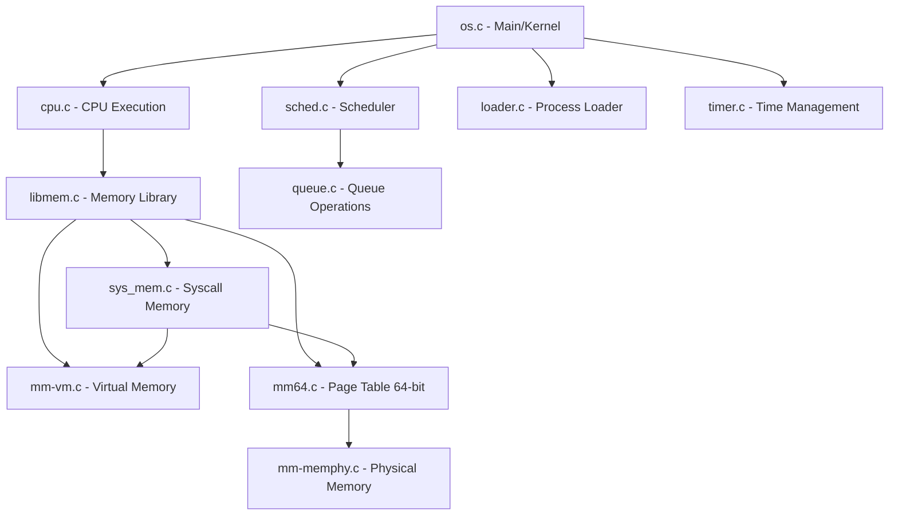
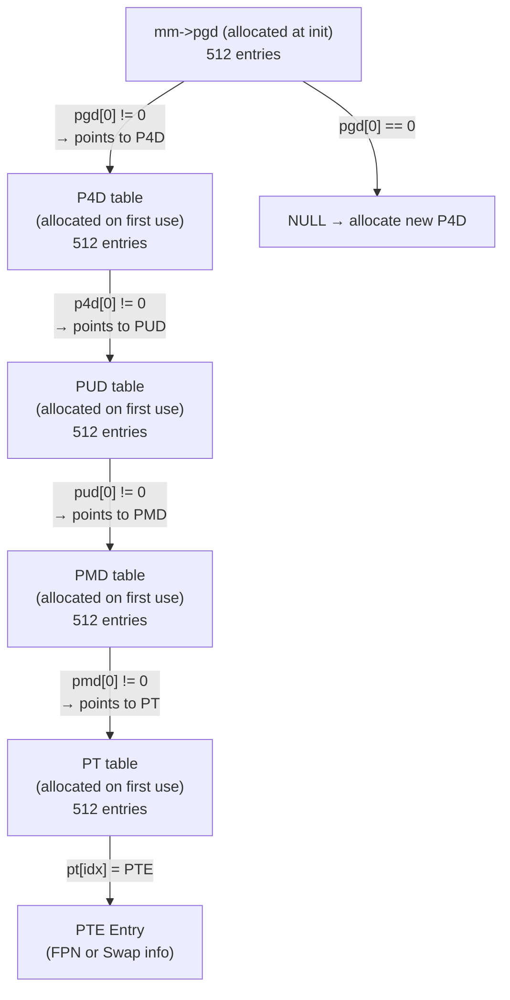
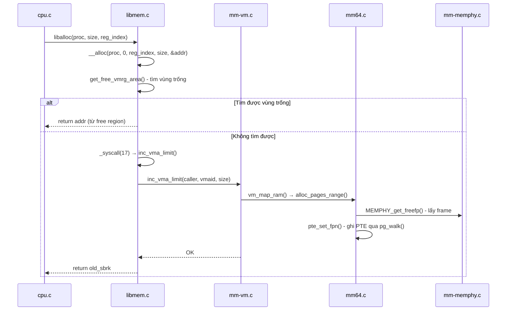

# Tài Liệu Chi Tiết - OS Simulator (Caitoa Release)

## Tổng Quan Dự Án

Đây là một **bộ mô phỏng hệ điều hành (OS Simulator)** với các tính năng:
- **Lập lịch đa hàng đợi (MLQ - Multi-Level Queue)**
- **Quản lý bộ nhớ phân trang 5 cấp (5-Level Paging) ở chế độ 64-bit**
- **Đa CPU** (multi-threaded simulation)
- **Syscall interface** cho các thao tác bộ nhớ

---

## Kiến Trúc Tổng Thể



---

## Danh Sách File Đã Modify và Giải Thích

### 1. `src/queue.c` — Hàng Đợi Tiến Trình

#### Vai trò
Queue là cấu trúc dữ liệu cơ bản nhất, dùng để lưu các process (PCB) trong ready queue, running list.

#### Các hàm đã implement

**`void enqueue(struct queue_t *q, struct pcb_t *proc)`**
- **Mục đích**: Thêm một process vào cuối hàng đợi
- **Logic**: Kiểm tra queue chưa đầy (`size < MAX_QUEUE_SIZE`), rồi đặt process vào vị trí `q->proc[q->size]`, tăng `size` lên 1
- **Tại sao thêm cuối**: Vì đây là FIFO — process nào vào trước thì được lấy ra trước

**`struct pcb_t *dequeue(struct queue_t *q)`**
- **Mục đích**: Lấy process đầu tiên ra khỏi hàng đợi
- **Logic**: Lấy `q->proc[0]`, rồi dịch tất cả phần tử còn lại lên 1 vị trí (shift left). Giảm `size` đi 1
- **Tại sao lấy đầu**: FIFO — phần tử đầu vào trước, ra trước

**`struct pcb_t *purgequeue(struct queue_t *q, struct pcb_t *proc)`**
- **Mục đích**: Xóa một process cụ thể khỏi hàng đợi (dùng khi process kết thúc)
- **Logic**: Tìm process theo con trỏ, khi tìm thấy thì shift các phần tử phía sau lên, giảm `size`

---

### 2. `src/sched.c` — Bộ Lập Lịch (Scheduler)

#### Vai trò
Quản lý việc phân phối CPU cho các process. Sử dụng **MLQ (Multi-Level Queue)** — mỗi mức ưu tiên có một hàng đợi riêng.

#### Cấu trúc dữ liệu chính
```c
static struct queue_t mlq_ready_queue[MAX_PRIO]; // 140 hàng đợi theo priority
static int slot[MAX_PRIO];                        // time slot cho mỗi mức
```

#### Hàm đã implement

**`struct pcb_t *get_mlq_proc(void)`**
- **Mục đích**: Lấy process có priority cao nhất (số nhỏ nhất) từ MLQ
- **Logic**:
  1. Lock mutex (vì nhiều CPU thread cùng gọi)
  2. Duyệt từ priority 0 → MAX_PRIO, tìm hàng đợi không rỗng đầu tiên
  3. Dequeue process từ hàng đợi đó
  4. Unlock mutex
  5. Thêm process vào `running_list` (để syscall tìm được)
- **Tại sao cần mutex**: Vì nhiều CPU thread chạy song song, nếu không lock thì 2 CPU có thể lấy cùng 1 process

**`void put_mlq_proc(struct pcb_t *proc)`**
- **Mục đích**: Đưa process trở lại hàng đợi MLQ (khi hết time slot)
- **Logic**: Enqueue vào `mlq_ready_queue[proc->prio]`

**`void add_mlq_proc(struct pcb_t *proc)`**
- **Mục đích**: Thêm process mới vào MLQ (khi vừa load xong)
- **Logic**: Tương tự `put_mlq_proc`, nhưng dùng cho process mới

**`struct pcb_t *get_proc(void)`** (non-MLQ version)
- **Logic**: Lấy từ `ready_queue` trước, nếu rỗng thì lấy từ `run_queue`

---

### 3. `src/mm64.c` — Bảng Trang 5 Cấp (64-bit Page Table) ⭐ QUAN TRỌNG NHẤT

#### Vai trò
Đây là file cốt lõi của hệ thống quản lý bộ nhớ. Implement bảng trang 5 cấp **cấp phát động** (dynamically allocated).

#### Kiến trúc bảng trang 5 cấp

```
Địa chỉ ảo 57-bit:
┌──────────┬──────────┬──────────┬──────────┬──────────┬────────────┐
│ PGD(9bit)│ P4D(9bit)│ PUD(9bit)│ PMD(9bit)│ PT(9bit) │ Offset(12) │
│ bit56-48 │ bit47-39 │ bit38-30 │ bit29-21 │ bit20-12 │ bit11-0    │
└──────────┴──────────┴──────────┴──────────┴──────────┴────────────┘
```

#### Cách hoạt động cấp phát động



**Quan trọng**: Với `PAGING64_MAX_PGN = 512` (bộ nhớ vật lý 2MB, page 4KB), các index PGD/P4D/PUD/PMD luôn = 0. Chỉ PT index thay đổi (0-511). Nên thực tế chỉ có 1 đường đi qua 4 cấp trên, nhưng cấu trúc vẫn dynamic.

#### Hàm cốt lõi: `pg_walk()` — Duyệt bảng trang

```c
static addr_t* pg_walk(struct mm_struct *mm, addr_t pgn, int alloc)
```

- **Mục đích**: Cho page number, trả về con trỏ đến PTE entry tương ứng
- **Tham số `alloc`**: 
  - `alloc=1`: Nếu sub-table chưa tồn tại → cấp phát mới (dùng khi set PTE)
  - `alloc=0`: Nếu sub-table chưa tồn tại → return NULL (dùng khi get PTE)
- **Logic chi tiết**:
  1. Gọi `get_pd_from_pagenum()` để tách page number thành 5 index: pgd_idx, p4d_idx, pud_idx, pmd_idx, pt_idx
  2. **Tầng PGD**: Đọc `mm->pgd[pgd_idx]`. Nếu == 0 và alloc==1 → `calloc()` một P4D table mới, lưu địa chỉ vào `pgd[pgd_idx]`. Update `mm->p4d` trỏ đến table mới
  3. **Tầng P4D**: Đọc `p4d_tbl[p4d_idx]`. Nếu == 0 → allocate PUD table. Update `mm->pud`
  4. **Tầng PUD**: Tương tự → allocate PMD table. Update `mm->pmd`  
  5. **Tầng PMD**: Tương tự → allocate PT table. Update `mm->pt`
  6. Return `&pt_tbl[pt_idx]` — con trỏ đến PTE

#### Các hàm PTE

**`int pte_set_fpn(caller, pgn, fpn)`**
- **Mục đích**: Đánh dấu page `pgn` đang ở RAM, frame number = `fpn`
- **Logic**: Gọi `pg_walk(mm, pgn, 1)` lấy PTE, set PRESENT bit, clear SWAPPED bit, ghi FPN

**`int pte_set_swap(caller, pgn, swptyp, swpoff)`**
- **Mục đích**: Đánh dấu page `pgn` đã bị swap ra disk, vị trí swap = `swpoff`
- **Logic**: Gọi `pg_walk(mm, pgn, 1)`, set PRESENT + SWAPPED bits, ghi swap info

**`uint32_t pte_get_entry(caller, pgn)`**
- **Mục đích**: Đọc PTE entry của page `pgn`
- **Logic**: Gọi `pg_walk(mm, pgn, 0)` — KHÔNG allocate nếu chưa có (return 0)

**`int pte_set_entry(caller, pgn, pte_val)`**
- **Mục đích**: Ghi trực tiếp giá trị PTE

#### Hàm init_mm()

```c
int init_mm(struct mm_struct *mm, struct pcb_t *caller)
```

- **Mục đích**: Khởi tạo memory management cho 1 process mới
- **Logic**:
  1. Allocate PGD root table (`calloc` 512 entries, tất cả = 0)
  2. Set `mm->p4d = mm->pud = mm->pmd = mm->pt = NULL` (chưa có sub-table nào)
  3. Tạo VMA0 (Virtual Memory Area mặc định), bắt đầu từ address 0
  4. Gán `mm->mmap = vma0`

#### Hàm alloc_pages_range()

- **Mục đích**: Xin `req_pgnum` frame vật lý từ RAM
- **Logic**: Gọi `MEMPHY_get_freefp()` lặp lại, tạo linked list các frame (`frm_lst`)
- **Lỗi -3000**: Hết frame → out of memory

#### Hàm vmap_page_range()

- **Mục đích**: Map một dãy page vào address space
- **Logic**: Với mỗi page, gọi `pte_set_fpn()` để ghi FPN vào PTE, và `enlist_pgn_node()` để track FIFO

#### Hàm vm_map_ram()

- **Mục đích**: Orchestrator — gọi `alloc_pages_range()` xin frame, rồi `vmap_page_range()` map vào page table

#### Hàm print_pgtbl()

- **Mục đích**: In địa chỉ các bảng trang ở mỗi cấp để debug và theo dõi.
- **Thay đổi mới nhất**: Đã thêm in `PID` của process đang gọi (`caller->pid`) để tránh nhầm lẫn khi in log.
- **Format**: 
  ```
  print_pgtbl:
  PID : <pid>
   PDG=<pgd_addr> P4g=<p4d_addr> PUD=<pud_addr> PMD=<pmd_addr>
  ```
- **Lưu ý về Thread Interleaving**: Do hệ thống mô phỏng chạy đa luồng (Multi-CPU), log in ra từ nhiều CPU có thể xen kẽ nhau trên cùng một màn hình (ví dụ: CPU 0 vừa báo dispatch PID 2 nhưng ngay dưới lại là log in page table của PID 4 do CPU 1 đang chạy song song). Việc in rõ `PID` giúp sinh viên dễ dàng trace đúng luồng hoạt động của từng process độc lập.

---

### 4. `src/mm-vm.c` — Virtual Memory Management

#### Vai trò
Quản lý vùng nhớ ảo (VMA), xử lý tăng giới hạn bộ nhớ, kiểm tra overlap.

#### Hàm quan trọng

**`int inc_vma_limit(caller, vmaid, inc_sz)`**
- **Mục đích**: Tăng giới hạn vùng nhớ ảo khi process cần thêm bộ nhớ
- **Logic**:
  1. Tính `inc_amt` = align `inc_sz` theo page size (4KB)
  2. Tính `incnumpage` = số page cần thêm
  3. Gọi `get_vm_area_node_at_brk()` lấy vùng nhớ mới tại break pointer
  4. Lưu `old_end = cur_vma->sbrk`
  5. Cập nhật `cur_vma->vm_end += inc_sz` và `cur_vma->sbrk += inc_sz`
  6. Gọi `vm_map_ram()` để cấp phát frame vật lý và map vào page table
- **Khi nào được gọi**: Khi `__alloc()` không tìm được vùng trống trong free region list

**`struct vm_rg_struct *get_vm_area_node_at_brk(caller, vmaid, size, alignedsz)`**
- **Mục đích**: Tạo region node mới tại vị trí break pointer hiện tại
- **Logic**: `newrg->rg_start = cur_vma->sbrk`, `newrg->rg_end = sbrk + size`

**`struct vm_area_struct *get_vma_by_num(mm, vmaid)`**
- **Mục đích**: Tìm VMA theo ID (vmaid=0 cho user space)

---

### 5. `src/libmem.c` — Memory Library (Giao diện chính)

#### Vai trò
Cung cấp các hàm mà CPU gọi khi thực thi lệnh ALLOC, FREE, READ, WRITE. Đây là cầu nối giữa CPU và hệ thống bộ nhớ.

#### Luồng hoạt động ALLOC



#### Hàm pg_getpage() — Lấy page vào RAM

- **Mục đích**: Đảm bảo page `pgn` có mặt trong RAM. Nếu đã swap ra → swap ngược lại
- **Logic (khi page chưa PRESENT)**:
  1. `find_victim_page()` → chọn page cũ nhất (FIFO) để đuổi ra
  2. `MEMPHY_get_freefp(active_mswp)` → lấy frame trống trên swap device
  3. Copy victim frame → swap (qua syscall SYSMEM_SWP_OP)
  4. Copy target page từ swap → victim's frame trong RAM  
  5. `pte_set_swap(victim)` → đánh dấu victim đã swap
  6. `pte_set_fpn(target)` → đánh dấu target đang ở RAM
  7. Thêm target page vào FIFO list

#### Hàm pg_getval() và pg_setval() — Đọc/Ghi memory

- **Logic**:
  1. Tách address → page number (PGN) + offset
  2. Gọi `pg_getpage()` đảm bảo page ở RAM, lấy FPN
  3. Tính physical address = `FPN * PAGE_SIZE + offset`
  4. Gọi `MEMPHY_read/write()` trên physical address

#### Hàm find_victim_page() — FIFO Page Replacement

- **Logic**: Duyệt linked list `mm->fifo_pgn` đến phần tử cuối cùng (oldest), xóa nó và trả về page number
- **Tại sao lấy cuối**: Vì khi enlist ta thêm vào đầu (stack-style), nên phần tử cuối là cũ nhất → FIFO

#### Hàm get_free_vmrg_area() — Tìm vùng trống

- **Logic**: Duyệt `vm_freerg_list`, tìm region có `size >= requested`. Nếu region lớn hơn cần → cắt bớt, giữ phần dư

---

### 6. `src/sys_mem.c` — System Call cho Memory

#### Hàm __sys_memmap()

- **Mục đích**: Xử lý syscall 17 (memmap) — là kernel handler cho các thao tác bộ nhớ
- **Thay đổi quan trọng**: Trước đây tạo dummy process bằng `malloc()`. Nay duyệt `running_list` để tìm đúng process đang gọi syscall (match PID)
- **Các operation**:
  - `SYSMEM_MAP_OP` → `vmap_pgd_memset()`: Map page table
  - `SYSMEM_INC_OP` → `inc_vma_limit()`: Tăng giới hạn VMA
  - `SYSMEM_SWP_OP` → `__mm_swap_page()`: Swap page RAM ↔ Disk
  - `SYSMEM_IO_READ` → `MEMPHY_read()`: Đọc physical memory
  - `SYSMEM_IO_WRITE` → `MEMPHY_write()`: Ghi physical memory

---

### 7. `src/os.c` — Kernel chính

#### Thay đổi: Process Memory Isolation

```c
// CŨ (SHARED mm - TẤT CẢ process dùng chung page table!)
struct krnl_t * krnl = proc->krnl = &os;

// MỚI (ISOLATED mm - mỗi process có page table riêng)
struct krnl_t * krnl = malloc(sizeof(struct krnl_t));
*krnl = os;          // Copy kernel state
proc->krnl = krnl;   // Gán cho process
```

**Tại sao cần thay đổi**: Nếu tất cả process dùng chung `krnl->mm`, thì khi process A alloc memory, nó sẽ ghi đè page table của process B → crash. Mỗi process cần `mm_struct` riêng.

---

### 8. `src/mm-memphy.c` — Physical Memory

#### Hàm MEMPHY_dump() (mới implement)
- **Mục đích**: In ra nội dung bộ nhớ vật lý (chỉ các byte khác 0) để debug

---

## Cấu Trúc Dữ Liệu Quan Trọng

### PTE (Page Table Entry) — 32 bit

```
┌─────────┬─────────┬─────────┬───────────┬─────────────────┐
│ PRESENT │ SWAPPED │ DIRTY   │ USRNUM    │ FPN (bits 12-0) │
│ bit 31  │ bit 30  │ bit 28  │ bits27-15 │ or SWAP info    │
└─────────┴─────────┴─────────┴───────────┴─────────────────┘
```

- **PRESENT=1, SWAPPED=0**: Page đang ở RAM, FPN chứa frame number
- **PRESENT=1, SWAPPED=1**: Page đã swap, chứa swap type + swap offset
- **PRESENT=0**: Page chưa được map

### mm_struct — Quản lý bộ nhớ của process

```c
struct mm_struct {
   addr_t *pgd;    // Root PGD table (luôn allocated)
   addr_t *p4d;    // Last-used P4D table (NULL ban đầu)
   addr_t *pud;    // Last-used PUD table (NULL ban đầu)
   addr_t *pmd;    // Last-used PMD table (NULL ban đầu)
   addr_t *pt;     // Last-used PT table (NULL ban đầu)
   
   struct vm_area_struct *mmap;              // Linked list VMA
   struct vm_rg_struct symrgtbl[30];         // Symbol table (biến)
   struct pgn_t *fifo_pgn;                   // FIFO queue cho page replacement
};
```

### krnl_t — Kernel state per process

```c
struct krnl_t {
   struct queue_t *ready_queue;     // Shared across processes
   struct queue_t *running_list;    // Shared - syscall dùng để tìm caller
   struct mm_struct *mm;            // PER-PROCESS - page table riêng
   struct memphy_struct *mram;      // Shared - physical RAM
   struct memphy_struct **mswp;     // Shared - swap devices
   addr_t *krnl_pgd/p4d/pud/pmd/pt; // Kernel page tables
};
```

---

## Luồng Thực Thi Hoàn Chỉnh

### 1. Khởi động (`os.c::main`)
1. Đọc config file → time_slot, num_cpus, num_processes, mem sizes
2. Init physical memory: `init_memphy(&mram)` + swap devices
3. Init scheduler: `init_scheduler()`
4. Tạo CPU threads + loader thread

### 2. Loader (`os.c::ld_routine`)
1. Init kernel page table directory (`krnl_pgd/p4d/pud/pmd/pt`)
2. Với mỗi process:
   - `load()` → parse file, tạo PCB
   - Tạo `krnl_t` riêng cho process (memory isolation)
   - `init_mm()` → tạo PGD root, VMA0
   - `add_proc()` → đưa vào MLQ scheduler

### 3. CPU Execution (`os.c::cpu_routine`)
1. `get_proc()` → lấy process từ MLQ (priority cao nhất)
2. `run(proc)` → thực thi 1 instruction
3. Nếu hết time slot → `put_proc()` trả lại MLQ
4. Nếu process xong → free, lấy process mới

### 4. Memory Operations
- **ALLOC** → `liballoc()` → `__alloc()` → tìm free region hoặc tăng VMA limit
- **FREE** → `libfree()` → `__free()` → trả region về free list
- **READ** → `libread()` → `pg_getval()` → `pg_getpage()` (swap nếu cần) → `MEMPHY_read()`
- **WRITE** → `libwrite()` → `pg_setval()` → `pg_getpage()` → `MEMPHY_write()`

---

## Tóm Tắt Các Thay Đổi

| File | Thay đổi | Mục đích |
|------|----------|----------|
| `queue.c` | Implement enqueue, dequeue, purgequeue | Queue cơ bản cho scheduler |
| `sched.c` | Implement get_mlq_proc với mutex | MLQ scheduling thread-safe |
| `mm64.c` | **pg_walk() + dynamic page table** | Bảng trang 5 cấp cấp phát động |
| `mm64.c` | pte_set_fpn/swap/get_entry dùng pg_walk | Truy cập PTE qua hệ thống phân cấp |
| `mm64.c` | init_mm chỉ alloc PGD | Sub-tables allocated on demand |
| `mm64.c` | alloc_pages_range, vmap_page_range | Cấp phát frame + map vào page table |
| `mm64.c` | print_pgtbl | In địa chỉ các bảng trang |
| `mm-vm.c` | inc_vma_limit | Tăng giới hạn VMA + map RAM |
| `libmem.c` | pg_getval, pg_setval | Đọc/ghi memory qua page table |
| `libmem.c` | pg_getpage swap logic | Page replacement FIFO |
| `sys_mem.c` | Tìm caller từ running_list | Syscall tìm đúng process context |
| `os.c` | Mỗi process có krnl_t riêng | Process memory isolation |
| `mm-memphy.c` | MEMPHY_dump | Debug physical memory |
